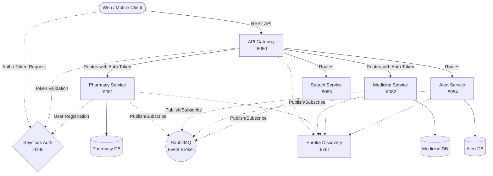

# PillPulse Backend

Welcome to the backend for **PillPulse**! This system is built using a modern Spring Boot microservices architecture, designed for scalability, reliability, and security.

## 🏗️ Architecture Overview

The backend is composed of several independent services communicating through an API Gateway, discovered via Eureka, and secured by Keycloak. Asynchronous events (like alerts and data sync) are handled via RabbitMQ.



## 🚀 Services

| Service | Port | Description |
|---|---|---|
| **API Gateway** | `8080` | The single entry point for all clients. Routes requests and validates JWT tokens. |
| **Eureka Server** | `8761` | Service Registry. All microservices register themselves here for load balancing and discovery. |
| **Pharmacy Service** | `8081` | Manages pharmacy registrations and profiles. Connects to Keycloak to provision user identities. |
| **Medicine Service** | `8082` | Manages drug inventories for pharmacies. |
| **Search Service** | `8083` | Handles fast querying and filtering of medicines and pharmacies across the system. |
| **Alert Service** | `8084` | Manages notifications, such as low stock alerts or system notifications. |

## 🛠️ Tech Stack
- **Framework**: Spring Boot 3.x, Spring Cloud
- **Security**: Keycloak (OAuth2 / OpenID Connect)
- **Database**: PostgreSQL
- **Message Broker**: RabbitMQ
- **Deployment**: Docker & Docker Compose

## 🐳 Running the Project

The easiest way to start the entire backend (including databases, message brokers, and Keycloak) is via Docker Compose.

1. Navigate to the `backend` directory.
2. Build the project using Maven:
   ```bash
   mvn clean package -DskipTests
   ```
3. Start the Docker containers:
   ```bash
   docker-compose up -d --build
   ```
4. **Keycloak Setup (First Run)**: Access Keycloak at `http://localhost:8180` and ensure your `pillpulse` realm, clients, and roles (e.g., `PHARMACY_ADMIN`) are configured.

## 🔐 Authentication Flow
1. The client requests a token from **Keycloak**.
2. Keycloak validates the credentials and returns a JWT.
3. The client attaches the JWT as a `Bearer` token in the `Authorization` header.
4. The **API Gateway** validates the token signature and extracts nested roles (e.g., `realm_access.roles`) to authorize access to protected endpoints.
