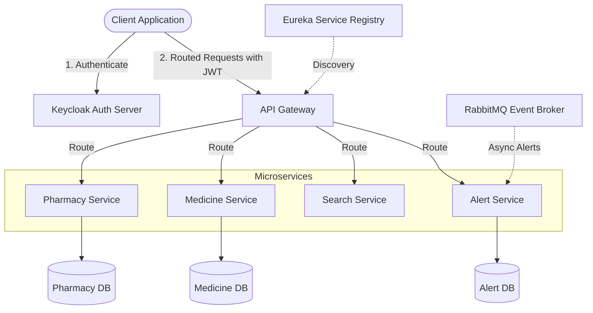

# PillPulse Backend

Welcome to the backend for **PillPulse**! This system is built using a modern Spring Boot microservices architecture, designed for high scalability, fault tolerance, and secure role-based access control.

---

## 🏗️ Architecture Overview

The backend is composed of decoupled microservices communicating through an API Gateway, discovered dynamically via Eureka, and secured by Keycloak. Asynchronous events (like stock alerts) are broadcast securely using RabbitMQ.



---

## Services & Ports

| Service | Port | Description | Database |
|---|---|---|---|
| **API Gateway** | `8080` | Entry point for all clients. Handles global CORS, routes requests, and validates JWT tokens. | *None* |
| **Eureka Server** | `8761` | Service Registry. Handles microservice discovery and load balancing. | *None* |
| **Pharmacy Service** | `8081` | Handles registrations, profile updates, and Keycloak user provisioning. | `pharmacy_db` (PostgreSQL) |
| **Medicine Service** | `8082` | Manages global drug data and local pharmacy stock inventories. | `medicine_db` (PostgreSQL) |
| **Search Service** | `8083` | Computes nearest pharmacies using the Haversine formula based on geolocation. | *None* (Integrates Feign) |
| **Alert Service** | `8084` | Manages stock alert subscriptions and notification histories. | `alert_db` (PostgreSQL) |

---

## Security & Role-Based Access Control (RBAC)

PillPulse implements a highly secure, fine-grained access control layer at the API Gateway using Keycloak OAuth2 / OpenID Connect. The gateway extracts nested roles from the JWT (`realm_access.roles`) and enforces authorization rules:

### SYSTEM_ADMIN
Platform managers responsible for global data integrity and store audits.
* **Global Catalog Management**: Can create, edit, or delete drugs in the global master catalog (`POST/PUT/DELETE /api/medicines/**`).
* **Pharmacy Supervision**: Can view all registered pharmacies (`GET /api/pharmacies`) and delete/suspend stores from the platform (`DELETE /api/pharmacies/{id}`).

### PHARMACY_ADMIN
Store owners or authorized staff managing their own inventories and profiles.
* **Local Inventory Management**: Can add drugs to their local stock (`POST /api/medicines/addToPharmacy`) and update or remove inventory (`PUT/DELETE /api/medicines/pharmacy/**`).
* **Profile Management**: Can view (`GET /api/pharmacies/{id}`) and update (`PUT /api/pharmacies/{id}`) their own pharmacy details.

---

## Core API Endpoints

### Authentication & Profiles
* `POST /api/auth/login` - Authenticate pharmacy credentials and return an enriched profile payload containing the JWT token.
* `POST /api/pharmacies/register` - Register a new pharmacy account and provision a Keycloak identity.
* `GET /api/pharmacies` - Retrieve all pharmacies *(Requires SYSTEM_ADMIN)*.
* `GET /api/pharmacies/{id}` - Retrieve a pharmacy's detailed profile.
* `PUT /api/pharmacies/{id}` - Update pharmacy profile details *(Requires PHARMACY_ADMIN)*.
* `DELETE /api/pharmacies/{id}` - Delete a pharmacy profile and revoke Keycloak access *(Requires SYSTEM_ADMIN)*.

### Global Catalog & Local Inventory
* `POST /api/medicines` - Create a new medicine definition globally *(Requires SYSTEM_ADMIN)*.
* `PUT /api/medicines/{id}` - Update a global medicine definition *(Requires SYSTEM_ADMIN)*.
* `DELETE /api/medicines/{id}` - Remove a global medicine definition *(Requires SYSTEM_ADMIN)*.
* `POST /api/medicines/addToPharmacy` - Add a medicine to a pharmacy's stock *(Requires PHARMACY_ADMIN)*.
* `PUT /api/medicines/pharmacy/{pharmacyId}/medicine/{medicineId}` - Update local stock quantity or price *(Requires PHARMACY_ADMIN)*.
* `DELETE /api/medicines/pharmacy/{pharmacyId}/medicine/{medicineId}` - Remove a medicine from a pharmacy's inventory *(Requires PHARMACY_ADMIN)*.

---

## Getting Started

### Prerequisites
* Java 21 & Maven 3.x
* Docker & Docker Compose
* Keycloak 23.0.0

### Running the Stack
1. Compile the microservices:
   ```bash
   mvn clean package -DskipTests
   ```
2. Start the infrastructure and database containers:
   ```bash
   docker-compose up -d --build
   ```
3. Import your Keycloak realm configuration using the Admin Console at `http://localhost:8180` (credentials: `admin` / `admin`).
